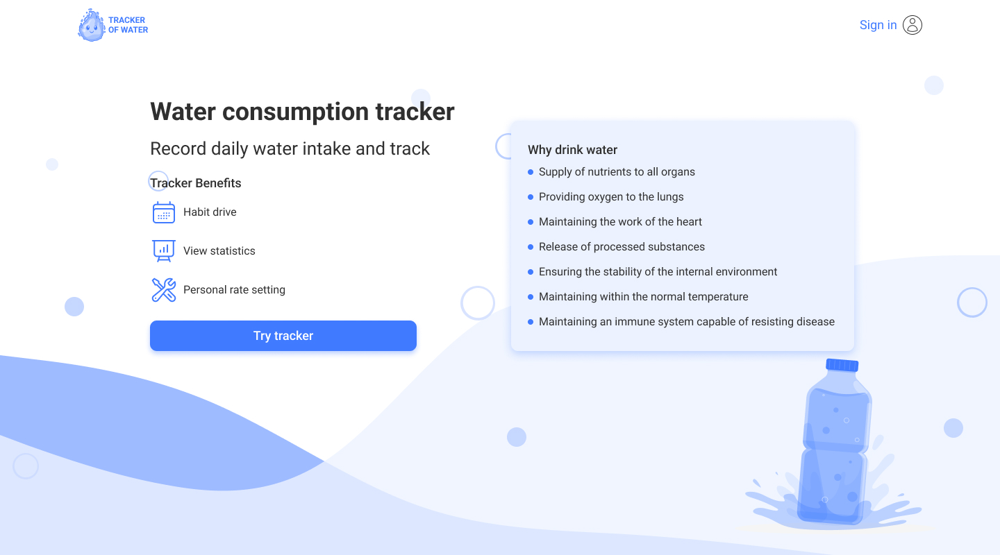
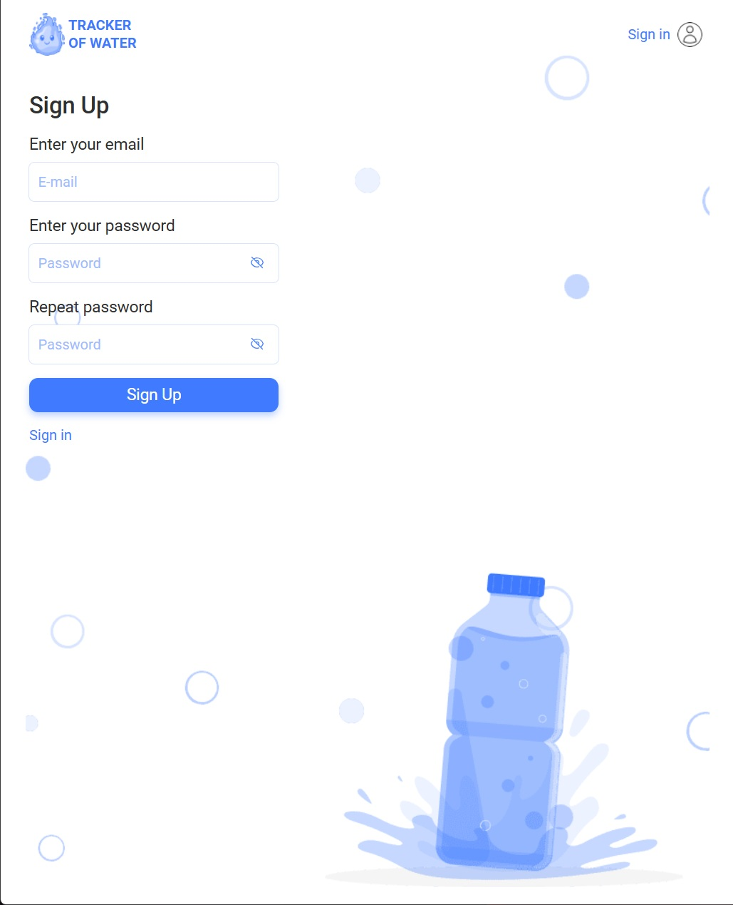
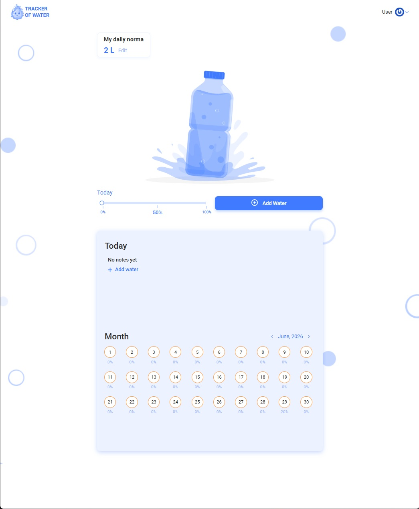
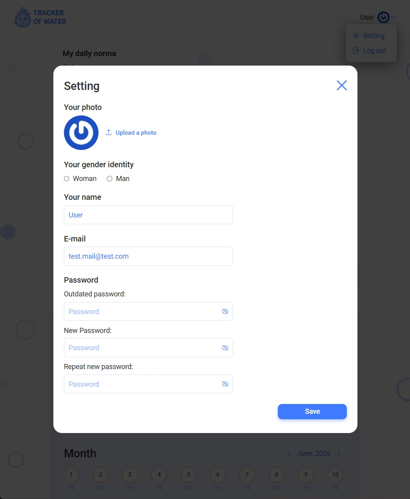

# Water Tracker

Water Tracker is a responsive web application that helps users calculate their
daily water intake, record consumed water, and monitor their progress over
time.

[Live Demo](https://summermoved0n.github.io/Water-Tracker-project/) ·
[Backend Repository](https://github.com/EvgenBilous/Project01_water_backend) ·
[API Documentation](https://project01-water-backend.onrender.com/api-docs)


## Features

- User registration, authentication, and persistent sessions
- Personal daily water-rate calculation
- Adding, editing, and deleting water entries
- Daily water-consumption progress
- Monthly statistics and calendar view
- User profile, password, and avatar management
- Form validation and API error handling
- Responsive layouts for mobile, tablet, and desktop

## Screenshots

| Welcome page | Authentication |
| --- | --- |
|  |  |

| Dashboard and monthly statistics | Profile settings |
| --- | --- |
|  |  |

## Technologies

- React 18 and React Router
- Vite
- Redux Toolkit, React Redux, and Redux Persist
- Axios
- Formik, React Hook Form, and Yup
- Emotion, Material UI, and CSS Modules
- Framer Motion
- React Toastify
- ESLint, Prettier, Husky, and lint-staged

## Getting Started

### Prerequisites

- Node.js 18 or newer
- npm

### Installation

```bash
git clone https://github.com/summermoved0n/Water-Tracker-project.git
cd Water-Tracker-project
npm install
npm run dev
```

Vite will print the local development URL in the terminal.

### Available Commands

```bash
npm run dev      # Start the development server
npm run lint     # Run ESLint
npm run build    # Create a production build
npm run preview  # Preview the production build locally
npm run format   # Format files in src with Prettier
```

## How It Works

1. Create an account or sign in.
2. Set a personal daily water rate using gender, weight, and activity time.
3. Record each consumed portion of water.
4. Edit or delete entries when necessary.
5. Review daily progress and monthly statistics.

## My Contribution

As a member of the CodeWave team, I contributed to both the backend and
frontend parts of the project:

- Integrated MongoDB for persistent application data
- Developed user-related API endpoints
- Integrated Cloudinary for avatar storage
- Developed the profile settings modal
- Improved authentication error handling and user feedback
- Reviewed and fixed modal behavior, responsive styles, and API interactions
- Configured and maintained the GitHub Pages deployment

## Project Structure

```text
src/
├── components/   Reusable UI and feature components
├── pages/        Route-level pages
├── redux/        Store, slices, selectors, and asynchronous operations
├── services/     Axios API services and notifications
├── schemas/      Validation schemas
├── utils/        Shared utilities
├── assets/       Fonts and common assets
└── images/       Responsive application images
```

## Deployment

The frontend is built with Vite and deployed to GitHub Pages through GitHub
Actions. The REST API is hosted separately on Render.

The backend may require a short startup period after being inactive.

## Team

| Team member | Role and contribution |
| --- | --- |
| [Viktoriia Otsabryk](https://github.com/Viktoriia3192) | Team Lead, calendar |
| [Denys Tkachov](https://github.com/DenysTkachov) | Scrum Master, welcome page |
| [Serhii Kravchenko](https://github.com/Serhii1727) | Swagger, water/today/month endpoints, backend |
| [Yevhen Bilous](https://github.com/EvgenBilous) | Sign in, sign up, backend |
| [Denys Hryhorenko](https://github.com/kladmone) | Header |
| [Dmytro Shulzhenko](https://github.com/summermoved0n) | MongoDB, users endpoints, Cloudinary, settings modal |
| [Andrii Horb](https://github.com/jn3107) | Daily water-rate modal |
| [Mark Tkach](https://github.com/Gentleman-88) | Modal, edit-water modal, loader |
| [Khrystyna Prokopechko](https://github.com/prokopechkok) | Redux, application routing, water list, ratio panel, protected routes |

## Project Status

The application was originally developed as a team project and later reviewed
and improved for portfolio use. The deployed version supports the complete
authentication, profile, water-tracking, and statistics workflow.
